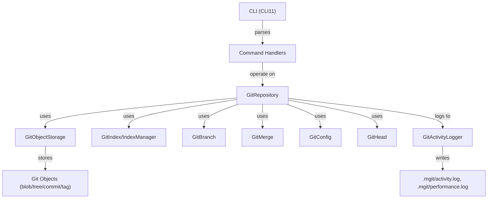

# mgit Architecture Overview

## Overview

`mgit` is a minimal, educational reimplementation of Git, written in C++. It is structured to be readable, modular, and extensible, with a focus on clarity and learning. The architecture is designed to mirror Git’s core concepts while providing a modern, maintainable codebase.

---

## Main Components

### 1. CLI Layer
- **CLISetupAndHandlers**: Uses CLI11 to parse commands and dispatches to handler functions.
- **Handlers**: Each command (e.g., `init`, `commit-tree`, `hash-object`) has a dedicated handler function that coordinates the operation.

### 2. Repository Layer
- **GitRepository**: Central class representing the repository. Manages object storage, index, branches, HEAD, and configuration.
- **GitConfig**: Handles repository/user configuration and remotes.
- **GitHead**: Manages the current branch and HEAD reference.
- **GitIndex/IndexManager**: Manages the staging area and conflict markers.
- **GitBranch/Branch**: Manages branch creation, deletion, and switching.
- **GitMerge**: Handles merge operations and conflict detection.

### 3. Object Model
- **GitObjectStorage**: Reads/writes objects (blobs, trees, commits, tags) to `.git/objects`.
- **GitObjectTypesClasses**: Defines object types and their serialization/deserialization.
- **BlobObject, TreeObject, CommitObject, TagObject**: Specialized classes for each object type.

### 4. Logging & Analytics
- **GitActivityLogger**: Logs all command activity, errors, and performance metrics. Supports AI-ready analysis and reporting.

### 5. Utilities
- **ZlibUtils/HashUtils**: Compression, decompression, and SHA-1 hashing utilities.

---

## Component Interaction Diagram



---

## Data Flow: Example Operations

### `mgit commit-tree`
1. CLI parses command and calls `handleCommitTree`.
2. Handler validates input, prepares commit data.
3. `GitRepository` serializes commit and writes to object storage.
4. Updates branch/HEAD as needed.
5. Logs activity and performance.

### `mgit merge <branch>`
1. CLI parses command and calls `handleMergeCommand`.
2. Handler invokes `GitMerge` to check for conflicts and perform merge.
3. Updates index, objects, and branch pointers.
4. Logs merge operation and any conflicts.

---

## Extensibility
- New commands can be added by creating a handler and registering it in `CLISetupAndHandlers`.
- Object types and storage can be extended for new Git features.
- Logging and analytics can be expanded for deeper AI-driven insights.

---

## Directory Structure

```
mgit/
├── src/
│   ├── main.cpp
│   ├── CLISetupAndHandlers.cpp
│   ├── GitRepository.cpp
│   ├── GitActivityLogger.cpp
│   ├── ...
│   └── headers/
│       ├── CLISetupAndHandlers.hpp
│       ├── GitRepository.hpp
│       ├── ...
├── docs/
│   ├── ARCHITECTURE.md
│   └── API_REFERENCE.md
```

---

## See Also
- [API Reference](API_REFERENCE.md) for detailed class and method documentation. 